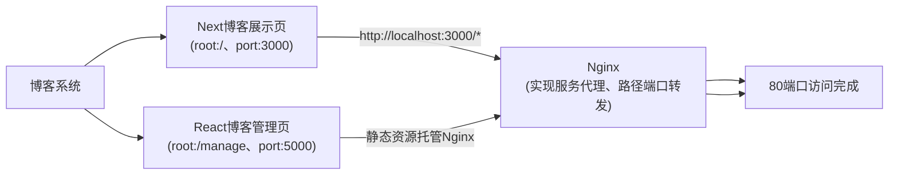
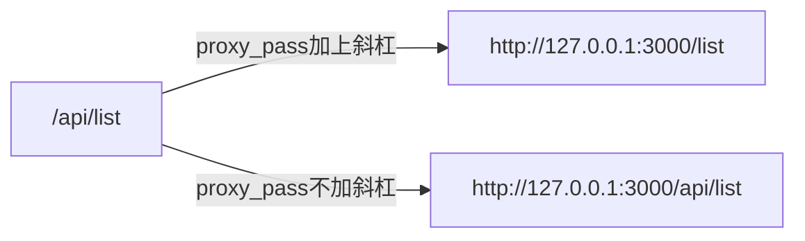

> 前面完成博客展示页面3000端口下部署至80端口，现在我们还需要将博客管理系统也部署该端口下，下面主要介绍下如何将该打包后的React资源正确部署。

## 目的

我们部署主要是为了实现于展示页面的统一性，如果再开放一个二级域名专门部署管理页面，对我们来说使用起来不太方便。何况部署https还需要申请两个证书。

## 思路与分析

为了实现将这两个应用部署于同一个域名下，首选需要对路由进行很好的规划设计：



对于其他路径`/*`认为请求的就是博客展示页面，该部分在前面已经完成。对于博客管理页面我们访问`/manage/*`的即可，下面开始一步一步实现。

## 解决方案

### React路由设计

一、设置`package.json`加入一行：

```json
{
  "name": "blog-manage",
  "homepage": "http://localhost/manage", // 指定主页路径
  "version": "0.1.0",
}
```

二、正常情况下我们在设计路由时默认根路径就是`/`，现在稍作改动需要在打包项目时给`BrowserRouter`指定basename即可（ps：管理页根路径为`/manage`不再是通常的`/`了）。

```js
<BrowserRouter basename="/manage"> // 加入basename后，我们设计的例如/edit的路由和相应的path都会自动加上/manage的前缀。
      <Layout>
        <Route path="/" exact component={Edit}></Route>
        <Route path="/edit" exact component={Edit}></Route>
        <Route path="/about" exact component={About}></Route>
      </Layout>
</BrowserRouter>
```

三、最后就是打包文件夹的名称也要修改，在`npm run eject`后的项目目录`config`中找到`paths.js`修改`appBuild`。

```js
module.exports = {
  dotenv: resolveApp('.env'),
  appPath: resolveApp('.'),
  appBuild: resolveApp('manage'), // 将build修改为manage
  ...
};
```

### Nginx配置

在nginx.conf文件中加入如下配置代理请求80端口转发至我们的管理页项目。

```nginx
server {
    listen 443 default_server ssl;
    server_name  www.xshellv.com;
    # 证书之类的配置
    ...

    # 博客展示页代理80根路径/至3000端口下（前面已完成）
    location / {
        proxy_pass http://127.0.0.1:3000;
        proxy_redirect off;
        proxy_set_header Host $host:10001;
        proxy_set_header Host $host:$server_port;
        proxy_set_header X-Real-IP $remote_addr;
        proxy_set_header X-Forwarded-For $proxy_add_x_forwarded_for;
    }

    # 博客管理页面代理80端口下的/manage路径至html文件夹下的静态资源
    location /manage {
        root   html; # 将打包文件夹manage放置于根文件文件夹html下
        index  index.html index.htm;
        try_files $uri /manage/index.html; # 每次url切换时始终返回index.html
    }
}
```

我的React应用中涉及的服务代理在如下`setupProxy.js`中。

```js
// setupProxy.js
const { createProxyMiddleware } = require('http-proxy-middleware');
module.exports = function (app) {
  app.use(
    createProxyMiddleware("/api", {
      target: 'http://localhost:3000',
      secure: false,
      changeOrigin: true,
      pathRewrite: {
        "^/api": "/",
      },
    })
  );
};
```

现在我们也要通过Nginx实现该服务的代理。否则静态资源中的接口访问都是404。因为所有的增删改查接口都放在博客展示页r中完成的，所以也去访问3000端口，当然每个人视情况而定。

```nginx
# 将静态资源涉及到的服务代理转发至3000端口
location  /api/ {
    proxy_pass   http://127.0.0.1:3000/; # 注意这里的斜杠
}
```

补充加斜杠和不加斜杠的区别：



## 参考文章

* [React 项目部署在 Nginx](https://www.jianshu.com/p/0d07a0992042)
* [引入koa-static 处理静态资源](https://www.jianshu.com/p/cd97cf6d0738)